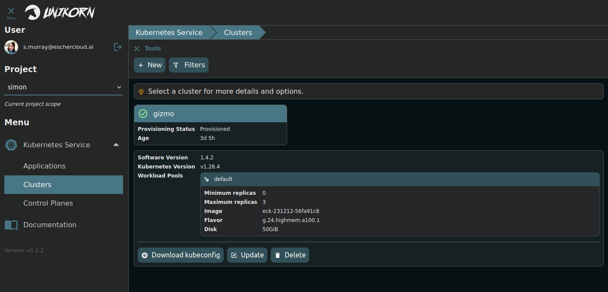

# Unikorn-UI

A badass, opinionated, deployer of souls!



## Overview

This is a user-friendly user interface built on top of [Unikorn](https://github.com/spjmurray/unikorn) server.

## Installing

Ensure you have a PAT that allows access to the images:

```
docker login ghcr.io --username spjmurray --password ghp_blahBlahBlah
```

Then install using your method of choice:

<details>
<summary>Helm</summary>

```shell
helm install unikorn-ui charts/unikorn-ui --namespace unikorn --create-namespace --set dockerConfig=$(base64 -w0 ~/.docker/config.json)
```
</details>

<details>
<summary>ArgoCD</summary>

```yaml
apiVersion: argoproj.io/v1alpha1
kind: Application
metadata:
  name: unikorn-ui
  namespace: argocd
spec:
  project: default
  source:
    path: charts/unikorn-ui
    repoURL: git@github.com:spjmurray/unikorn-ui
    targetRevision: v0.2.2
    helm:
      parameters:
      - name: dockerConfig
        value: # output of "base64 -w0 ~/.docker/config.json"
  destination:
    namespace: unikorn
    server: https://kubernetes.default.svc
  syncPolicy:
    automated:
      prune: true
      selfHeal: true
    syncOptions:
    - CreateNamespace=true
```
</details>

## Building the Container

```shell
make image
```

## Developemnt

### Installing

Install a modern version of Node.js and add the `/bin` directory to your path.

### Linting

```shell
npm run lint
```

### Code Formatting

```shell
npm run format
```
